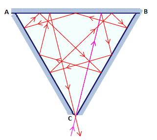

# Problem 3: Investigating multiple reflections of a laser beam

### Problem Description

In laser physics, a "white cell" is a mirror system that acts as a delay line for the laser beam. The beam enters the cell, bounces around on the mirrors, and eventually works its way back out. The specific white cell we will be considering is an equilateral triangle with a side length of 20 cm suspended symmetrically on the origin (the lower vertex C is at the origin) with the +x axis pointing to the right and the +y axis pointing up. The sections corresponding to y ≤ 0.01 cm are missing, allowing the laser beam to enter and exit through the gap. The light beam always passes through the origin when entering the “cell”. Each time the laser beam hits an interior surface, it follows the usual law of reflection "angle of incidence equals angle of reflection." That is, both the incident and reflected beams make the same angle with the normal line at the point of incidence. The figure below illustrates a possible scenario.

### Inputs and Outputs

1. The program takes a single command line argument that represents the initial reflection’s x location along the AB segment and calculates the number of times the beam is reflected off an internal surface of the white cell before exiting.

2. The program outputs just this number of reflections to a text file called output3.txt.
