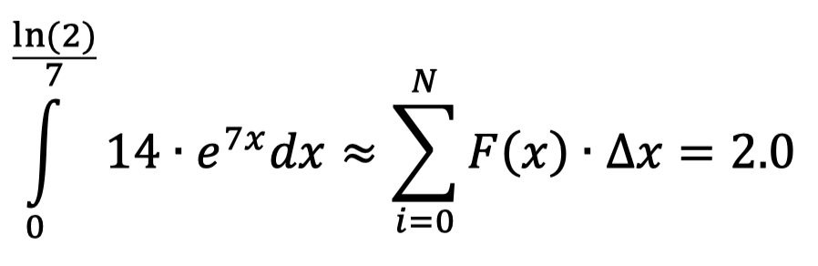
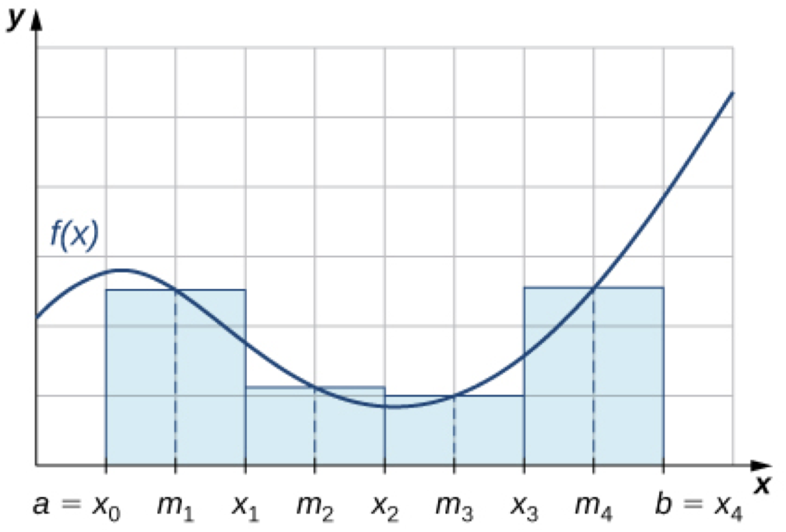

# Problem 5: Numerical Integration

### Problem Description

The program uses OpenMP to compute the integral below using the midpoint rule. The midpoint rule divides the region to be integrated into N evenly spaced segments. The value of the function is determined at each location and then multiplied by the size of the subsection. This product is then summed for all the subsections to get an estimate of the actual value.

### Inputs and Outputs

1. The program takes a single command line argument that is the number of subdivisions (N) to use in the calculations.
2. The program outputs to the text file Lab2Prob2.txt the estimation of the integral, overwriting any previous results.
