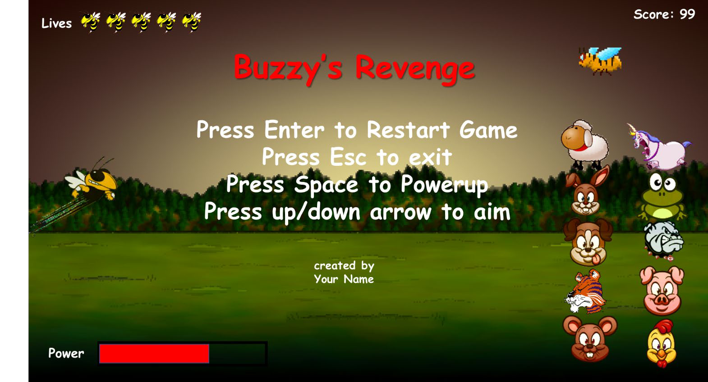

# Problem 6: Buzzy’s Revenge

### Problem Description

This project creates a derivation of “Angry Birds” called “Buzzy’s Revenge” using the SFML API. In this game, the user launches buzzy across the field attempting to hit the evil mascots from other universities, while avoiding the cute woodland creatures.

### Game Rules

1. The application needs to create the opening screen shown above and have the game start when the user hits the “Enter” key.

2. The “space” key is used to increase buzzy’s initial velocity. As the user holds down the key the power indicator advances. You need to determine the minimum and maximum initial velocity that buzzy will have when launched when the space key is released. You need to setup the game’s dimensions so that buzzy takes 1-4 secs to travel across the field.

3. Buzzy’s initial launch angle is increased and decreased using the “up” and “down” arrow keys. The buzzy image needs to be rotated to indicate the changing launch angle.

4. Buzzy flight across the field follows a simple projectile motion path.
4. The rotation angle of buzzy should change as he fly across the field.
6. When buzzy hits one of the evil mascots (shown below) you get 25 pts and that column disappears.
6. When both mascots are hit the level is recreated.
8. Creating the columns.
   1. Only one evil mascot should be in each column.
   2. The vertical placement of the evil mascots should randomly change each time the level is recreated.
   3. The placement of all the other wood land creatures should also change each time the level is recreated.

9. The bee should fly from right to left along a random/changing path. If buzzy is able to intercept the bee then the user gets 75 extra points. The bee disappears until the level is recreated.
10. If the user is able to hit the mad unicorn then the user gets an extra life up to a maximum of 5 lives. When hit the mad unicorn disappears and all the images above drop down by one.
11. Buzzy uses up a life when he is launched and does not hit either
    1. An evil mascot
    2. The bee
    3. The mad unicorn

12. If buzzy hits a woodland creature he immediate reappears back at his launch point.
13. If buzzy does not hit anything then he immediate reappears back at his launch point when the center of the buzzy image leaves the screen.
14. The game ends when buzzy uses up all his lives.
15. Each time a life is lost one of the life images ( )should disappear.
16. The score needs to be updated when points are won.
16. If buzzy hits a woodland creature then he falls back spinning to the bottom of the screen before reappearing.
16. Instead of just having a column disappear, have the images fall spinning to the bottom of the screen before disappearing.
16. Add sound effects.