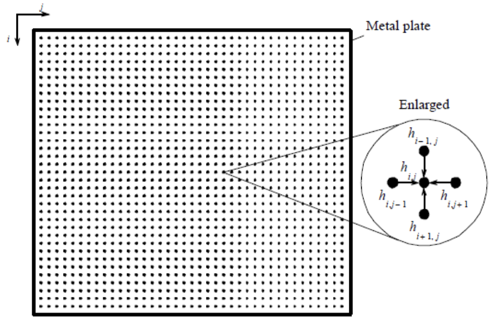

# Problem 8: 2D Steady State Heat Conduction in a Thin Plate

## Problem Description

This is a CUDA program to determine the steady state heat distribution in a thin metal plate using synchronous iteration on a GPU, solving Laplace's equation using the finite difference method which has wide application in science and engineering. Consider a thin plate is perfectly insulated on the top and bottom which has known temperatures along each of its edges. The objective is to find the steady state temperature distribution inside the plate. The temperature of the interior will depend upon the temperatures around it. We can find the temperature distribution by dividing the area into a fine mesh of points, hi,j . The temperature at an inside point can be taken to be the average of the temperatures of the four neighboring points, as illustrated below.

## Inputs and Outputs

1. The program needs to take the following command line arguments:
   1. -N 256 - the number of N x N interior points.
   2. -I 10000 – the number of iterations
   3. -q – quits the application
2. Uses type double for the arrays.
3. Output to the console the number of milliseconds it took to calculate the solution using CUDA events.
4. Write out to a text file the final temperature values using a comma to separate the values in the file “finalTemperatures.csv”. Each row of temperature values should be on a separate line.

## Additional Rules

For this calculation, it is convenient to describe the edges by points adjacent to the interior points. The interior points of h i,j are where 0 < i < n, 0 < j < n [(n -1) x (n - 1) interior points]. The edge points are when i = 0, i = n, j = 0, or j = n, and have fixed values corresponding to the fixed temperatures of the edges. Hence, the full range of h i,j is 0 ≤ 𝑖𝑖 ≤ 𝑛𝑛 , 0 ≤ 𝑗𝑗 ≤ 𝑛𝑛, and there are (n + 1) x (n + 1) points. We can compute the temperature of each point by iterating the equation:

(0 ≤ 𝑖𝑖 ≤ 𝑛𝑛 , 0 ≤ 𝑗𝑗 ≤ 𝑛𝑛) for a fixed number of iterations or until the difference between iterations of a point is less than some very small prescribed amount. This iteration equation occurs in several other similar problems; for example, with pressure and voltage. More complex versions appear for solving important problems in science and engineering. In fact, we are solving a system of linear equations. The method is known as the finite difference method. It can be extended into three dimensions by taking the average of six neighboring points, two in each dimension. We are also solving Laplace’sequation.

## Setup

A perfectly insulted thin plate with the sides held at 20 °C and a short segment on one side is held at 100 °C is shown below:

