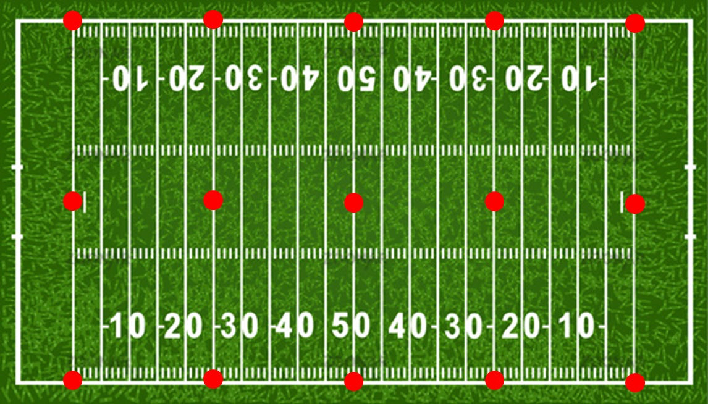

# Problem 9: OpenGL

3D simulation for a Show using UAVs

## Problem Description

The company you work for has been selected to develop a half-time show using UAVs. You need to develop a 3D simulation using std::thread and OpenGL to demo the show to the game organizers for their approval.

## Additional Rules

Below is a description of the show that you will be creating with a 3D simulation.

1) The show is made up of 15 UAVs that are placed on the football field at the 0, 25, 50, 25, 0 yard-lines as shown below by the red dots.

2) The UAVs remain on the ground for 5 seconds after the beginning of the simulation.

3) After the initial 5 seconds the UAVs then launch from the ground and go towards the point (0, 0, 50 m) above the ground with a maximum velocity of 2 m/s

4) As they approach the point, (0, 0, 50 m), they began to fly in random paths along the surface of a virtual sphere of radius 10 m while attempting to maintain a speed between 2 to 10 m/s.

5) The simulation ends once all of the UAV have come within 10 m of the point, (0, 0, 50 m), and the UAVs have flown along the surface for 60 seconds.

6) Each UAV has the following

   1) Each UAV has a mass of 1 kg and is able to generate a single force vector with a total maximum magnitude of 20 N in any direction.
   2) Scale each UAV so it is just small enough to fix in a 20-cm cube bounding box.

   Pick a UAV object from the attached zip file. There are lots of free 3D objects online and for an extra 20 extra bonus points place a texture map on a 3D object of your choosing or on one of the included 3D objects.

7) You must develop a multithread application using 16 threads. The main thread is responsible for rendering the 3D scene with the 15 UAVs and a green (RGB=(0,255,0)) rectangle representing the football field in a 400 x 400 window. You will get 10 extra bonus points for using a bitmap file called ff.bmp in the same location as the executable to apply a football field texture to the rectangle. The other 15 threads are each responsible for controlling the motion of a single UAV.

8) Create a class called ECE_UAV that has member variables to contain the mass, (x, y, z) position, (vx, vy, yz) velocities, and (ax, ay, az) accelerations of the UAV. The ECE_UAV class also contains a member variable of type std::thread. A member function start() causes the thread member variable to run an external function called threadFunction

   **void threadFunction(ECE_UAV* pUAV);**

​		The threadFunction updates the kinematic information every 10 msec.

9) The main thread polls the UAV once every 30 msec to determine their current locations in order to update the 3D scene.
10) The coordinate system of the 3D simulation is defined as follows: The origin is located at the center of the football field at ground level. The positive z axis points straight up, and the x axis is along the width of the field and the y axis is along the length.
11) A camera location, orientation, and field of view should be used so that the whole football field and the virtual 10m sphere is in the view. You can display a semitransparent representation of the virtual sphere.
12) The flight of the UAV is controlled by the following kinematic rules
    1) The force vector created by the UAV plus the force of gravity (10 N in the negative z direction) determine the direction of acceleration for the UAV.
    2) Use Newton’s 2 nd Law to determine the acceleration of the UAV in each direction.
    3) Use the equations of motion for constant acceleration in each direction (xyz) to determine the location and velocity of the UAV every 10 msec.
    4) You can use any method you want to maintain the UAVs flight path along the surface of the 10m radius virtual sphere. One possible method to consider is to use a variation of Hooke’s Law simulating a virtual spring between the surface of the sphere and the radial distance of the UAV from the center of the sphere.
13) If the bounding boxes of two UAVs come within 1 cm of each other an elastic collision occurs. For simplicity we are going to model the UAVs as point objects and the UAVs will just swap velocity vectors for the next time step.
14) The magnitude of the color of your UAV should oscillate between full and half color throughout the simulation.