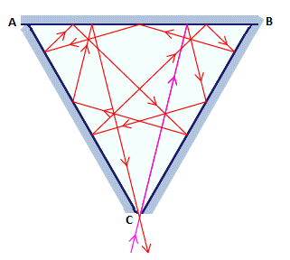
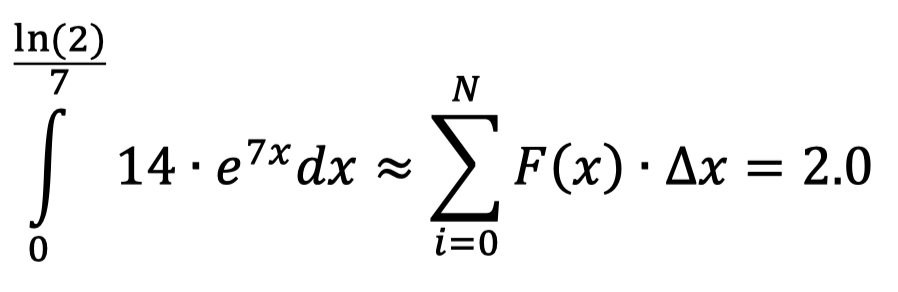
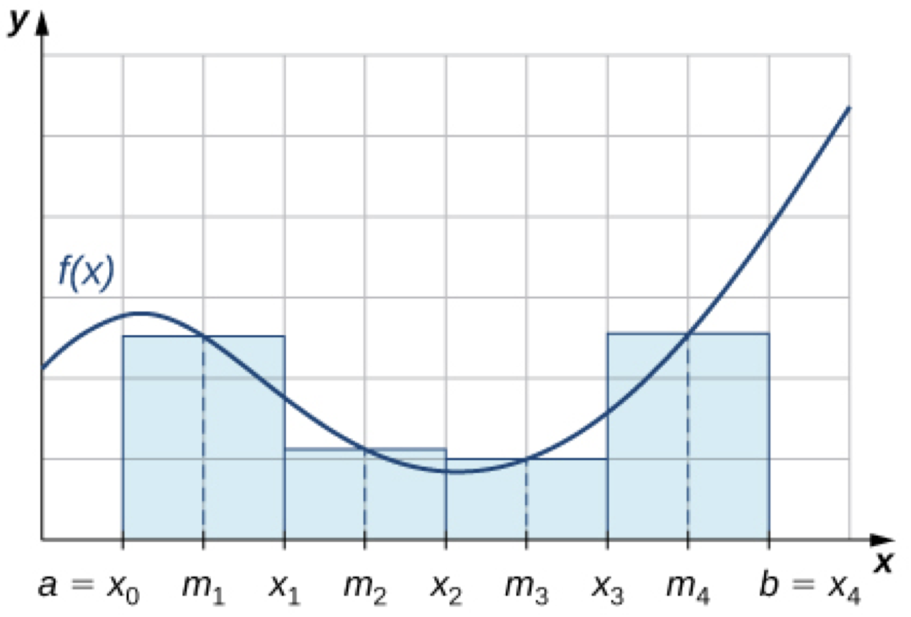
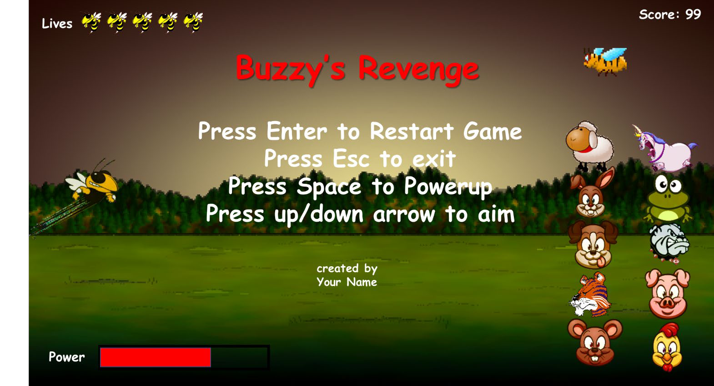
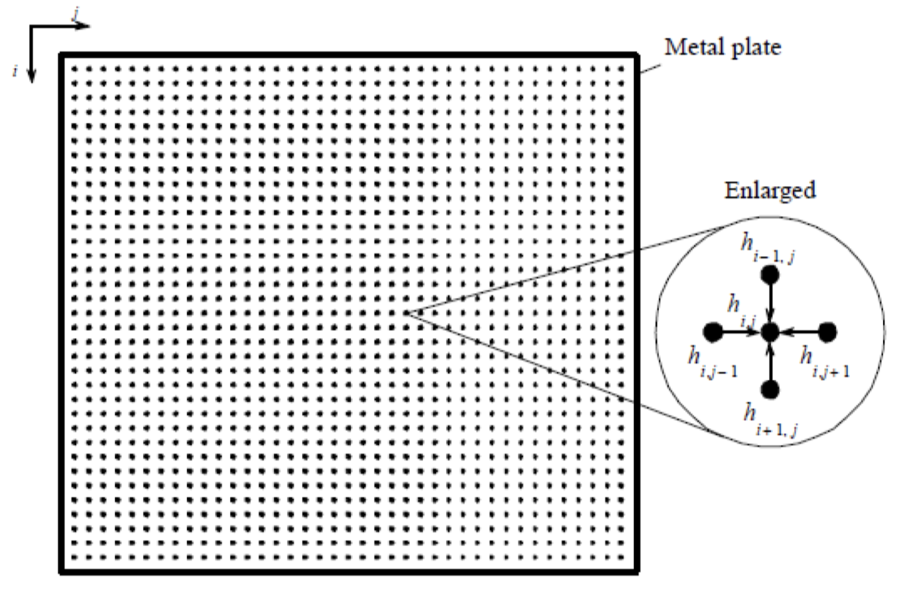
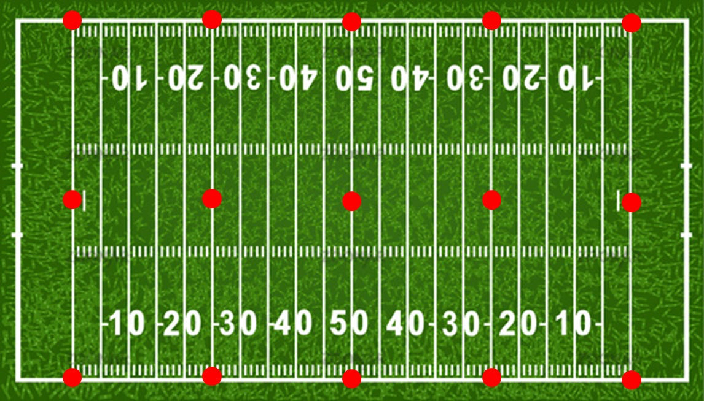

## Problem 1: Prime Factors

### Problem Description

The prime factors of 13195 are 5, 7, 13 and 29. The program takes one command-line argument variable of type unsigned long and contains two functions:

1. int main(int argc, char* argv[]) – parses the input parameter and calls the function GetPrimeFactors(const unsigned long ulInputNumber, string &strOutput) to calculate the prime factors of ulInputNumber.

2. bool GetPrimeFactors (const unsigned long ulInputNumber, string &strOutput) – determines the prime factors of ulInputNumber. If there are no prime factors then the function returns false, otherwise the function returns true. Any prime factors are concatenated into the function parameter strOutput using a comma to separate the factors.

## Problem 2: Langton’s Ant

### Problem Description

An ant moves on a regular grid of squares that are colored either black or white. The ant is always oriented in one of the cardinal directions (left, right, up or down) and moves from square to adjacent square according to the following rules:

1. if it is on a black square, it flips the color of the square to white, rotates 90 degrees counterclockwise and moves forward one square.
2.  if it is on a white square, it flips the color of the square to black, rotates 90 degrees clockwise and moves forward one square.

Starting with a grid that is entirely white, you will need to determine how many squares are black after some number of moves of the ant?

## Problem 3: Investigating multiple reflections of a laser beam

### Problem Description

In laser physics, a "white cell" is a mirror system that acts as a delay line for the laser beam. The beam enters the cell, bounces around on the mirrors, and eventually works its way back out. The specific white cell we will be considering is an equilateral triangle with a side length of 20 cm suspended symmetrically on the origin (the lower vertex C is at the origin) with the +x axis pointing to the right and the +y axis pointing up. The sections corresponding to y ≤ 0.01 cm are missing, allowing the laser beam to enter and exit through the gap. The light beam always passes through the origin when entering the “cell”. Each time the laser beam hits an interior surface, it follows the usual law of reflection "angle of incidence equals angle of reflection." That is, both the incident and reflected beams make the same angle with the normal line at the point of incidence. The figure below illustrates a possible scenario.

## Problem 4: Ant and seeds

### Problem Description

A laborious ant walks randomly on a 5x5 grid. The walk starts from the central square. At each step, the ant moves to an adjacent square at random (up, down, left, right), without leaving the grid; thus there are 2, 3 or 4 possible moves at each step depending on the ant's position.

At the start of the walk, a seed is placed on each square of the lower row. When the ant isn't carrying a seed and reaches a square of the lower row containing a seed, it will start to carry the seed. The ant will drop the seed on the first empty square of the upper row it eventually reaches.

## Problem 5: Numerical Integration

### Problem Description

The program uses OpenMP to compute the integral below using the midpoint rule. The midpoint rule divides the region to be integrated into N evenly spaced segments. The value of the function is determined at each location and then multiplied by the size of the subsection. This product is then summed for all the subsections to get an estimate of the actual value.

## Problem 6: Buzzy’s Revenge

### Problem Description

This project creates a derivation of “Angry Birds” called “Buzzy’s Revenge” using the SFML API. In this game, the user launches buzzy across the field attempting to hit the evil mascots from other universities, while avoiding the cute woodland creatures.

## Problem 7: TCP Sockets: Debug Logging Server 

### Problem Description

In real world applications debug/status messages from applications are often sent to a central logging server so that any issues that may occur can be investigated as to the cause. This project creates a TCP debug logging server.

#### Server

Write a console program that takes as a single command line argument the port number on which the TCP Server will listen for connection requests. Your server application needs to be able to maintain the connections from multiple clients. The clients will be sending text string messages that the server will save in a file called server.log in the same directory as the server application. The server will add a newline character to the end of each message when saving to the text file. All messages shall be appended to the server.log file if it already exists, otherwise a new file will be created. The server logs when clients connect and disconnect.

#### Client

A client console program takes as a command line argument the IP Address and port number of the server as shown below:

./a.out localhost 61717 The program should continuously prompt the user for messages to send to the server. Here is example prompting the user for messages

**Please enter a message:**

## Problem 8: 2D Steady State Heat Conduction in a Thin Plate

### Problem Description

This is a CUDA program to determine the steady state heat distribution in a thin metal plate using synchronous iteration on a GPU, solving Laplace's equation using the finite difference method which has wide application in science and engineering. Consider a thin plate is perfectly insulated on the top and bottom which has known temperatures along each of its edges. The objective is to find the steady state temperature distribution inside the plate. The temperature of the interior will depend upon the temperatures around it. We can find the temperature distribution by dividing the area into a fine mesh of points, hi,j . The temperature at an inside point can be taken to be the average of the temperatures of the four neighboring points, as illustrated below.

## Problem 9: 3D simulation for a Half-time Show using UAVs

### Problem Description

The company you work for has been selected to develop a half-time show using UAVs. You need to develop a 3D simulation using std::thread and OpenGL to demo the show to the game organizers for their approval.

